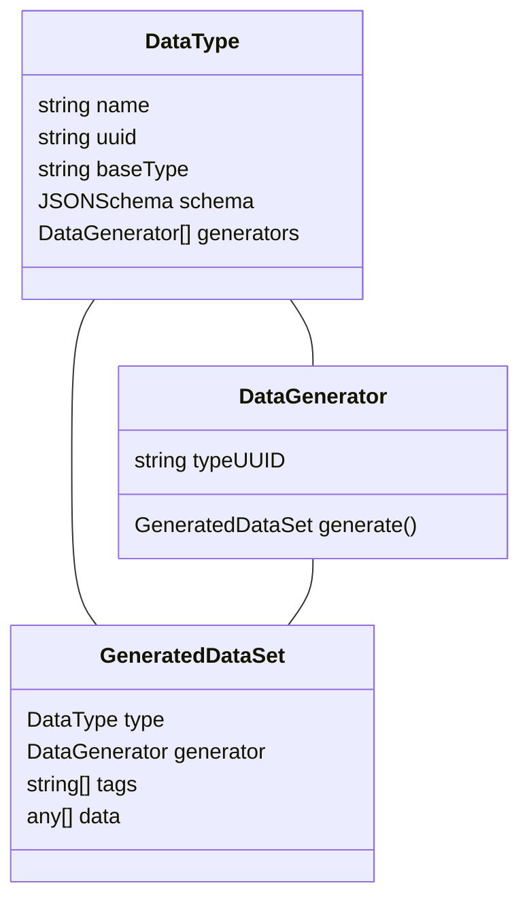

```TypeScript
const between = (params)=>{
  const [a,b] = params;
  return Math.floor(Math.random() * (b-a)) + a;
}
const HouseNr = {
  typeName: 'HouseNr',
  schema: {
    type: 'Integer',
    generation: {
      ruleName: between,
      params: [1,300],
    }
  }
}

const Address = {
  typeName: 'Address',
  schema:{
    type: 'Object',
    childElements: {
      country: {},
      city:{},
      street:{},
      houseNr: HouseNr,
      zipCode: {},
    }
  }
}


```